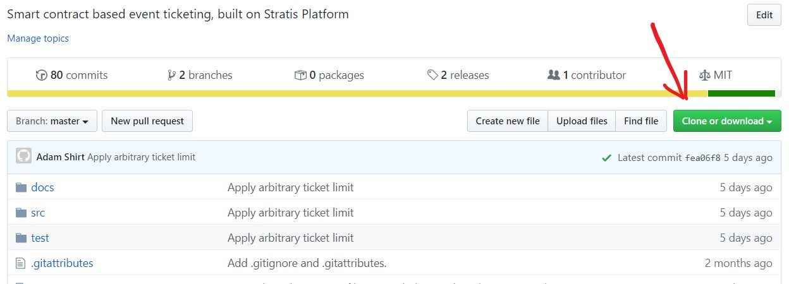
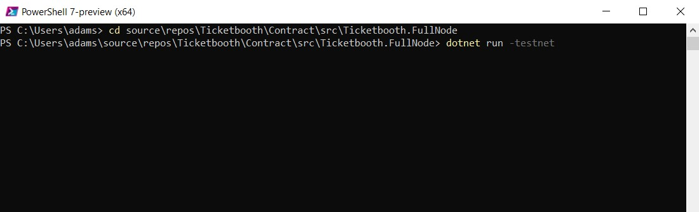

# Running a Full Node

## Introduction

Ticketbooth smart contracts run on Stratis platform Cirrus blockchain, which is supported by individuals or organisations running their own nodes. Running a full node allows you to interact with the network. There is both a Cirrus main network and a test network and it is important that you interact with the main network **ONLY** through your own node.

While it is possible to interact with Ticketbooth smart contracts through a standard Cirrus full node, it is recommended to use the Ticketbooth-enabled full node. This comes with an API extension, which makes it much easier and simpler to interact with Ticketbooth.

## On your local machine

You can run a full node on your local machine, simply by cloning the Ticketbooth repository and running the project. You need the [.NET Core SDK](https://dotnet.microsoft.com/download) v2.1 or later installed on your machine to run the project.

Navigate to the [Github repository](https://github.com/drmathias/Ticketbooth) and select the _Clone or download_ button, then either download and unzip the code or clone it through Github desktop or Visual Studio.



Open a shell that you can use to interact with the command line, then navigate the terminal to the folder that contains the _Ticketbooth.FullNode.csproj_ project file. You can find this at the directory you cloned the repository into, then navigate to _src/Ticketbooth.FullNode/_. Now start a full node by running ```dotnet run``` to run on the main network, or ```dotnet run -testnet``` to run on the test network.



# Viewing Swagger UI

A Swagger UI is bundled with the full node, allowing you to view documentation and interact with available web API endpoints. These endpoints include Ticketbooth web API, along with other full node features. To view the Swagger UI, simply navigate to [http://localhost:37223/swagger/index.html](http://localhost:37223/swagger/index.html) if running on the main network, or [http://localhost:38223/swagger/index.html](http://localhost:38223/swagger/index.html) for the test network.